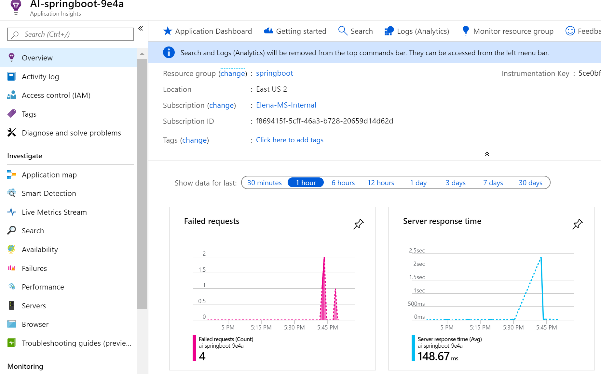
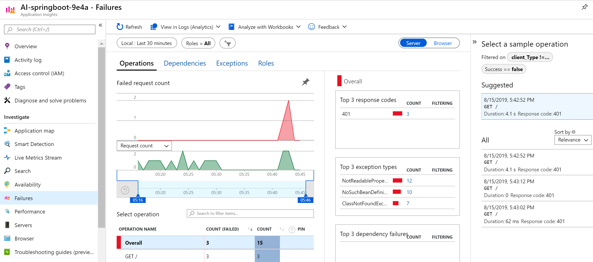
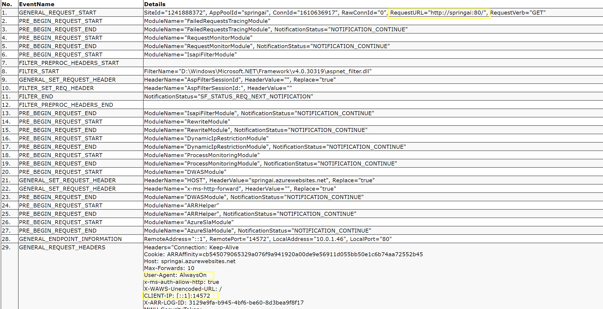
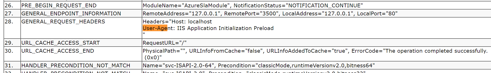

## Authenticated SpringBoot App with AppInsights

App Service with "AlwaysOn" feature will ping application ROOT every 5 min,
which will cause a lot of "401" failures for application with enabled authentication.



In our example we use simple Eureka Server SpringBoot application with Basic Auth.
User is set in `WebSecurityConfig` class and password in App Service Application Settings 
in variable `EUREKA_PASSWORD`.

## Unauthenticated Healthcheck endpoint

We need endpoint without authentication enabled to serve as a healthcheck url.
Actuator `/actuator/health` endpoint is good for this purpose.
To disable authentication only on this url for the application add following to `WebSecurityConfig`:

```java
@Override
protected void configure(HttpSecurity http) throws Exception {
    http
        .authorizeRequests()
             // Permit health endpoint 
            .antMatchers("/actuator/health").permitAll()
            // require AUTH for all others 
            .anyRequest().authenticated()
            .and()
        .csrf().ignoringAntMatchers("/eureka/**")
            .and()
        .httpBasic();

}
```   
## Point AlwaysOn to custom URL

By default `AlwaysOn` hits ROOT url of the application, it does not have configuration that could be changed.


We could implement a redirect that will happen only for the `AlwaysOn` User-Agent requests by adding a rule to `web.config` that redirects only those request that come from localhot `::1` and with required `User-Agent`:



Add rule:

```
<rewrite>
    <rules>
    <rule name="Rewrite AlwaysOn" stopProcessing="true">
        <match url="^$" />
        <conditions>
        <add input="{HTTP_USER_AGENT}" pattern="^AlwaysOn$" />
        <add input="{REMOTE_ADDR}" pattern="::1" />
        </conditions>
        <action type="Rewrite" url="/actuator/health" />
    </rule>
    </rules>
</rewrite>
```            

## Point Application Initialization module to custome URL
Once we repointed `AlwaysOn` the only 401 errors we still see in log are from the application initialization performed by IIS server



To repoint add following 

```
<applicationInitialization remapManagedRequestsTo="/hostingstart.html"
                           skipManagedModules="true" >
      <add initializationPage="/actuator/health" />
</applicationInitialization>
```
While application is being initialized (and java boot app might take a while) the splash screen that app init access is set in `remapManagedRequestsTo` url. We need this URL to be as fast as possible and preferably just static file not coming from Java application. By default when App Service is created it creates file `hostingstart.html` under `wwwroot` and it's exactly  what we could leverage.
Last step is to make sure we have handler that would serve this staticfile as we configured all the urls to be server by java engine. To add static handler add following to `web.config`:

```
   <add name="StaticFileStart" path="hostingstart.html" verb="*" modules="StaticFileModule" resourceType="Either" requireAccess="Read" />
```

It will handle and serve the html file. And now we do not have any 401 errors in the logs and Application Insights.

